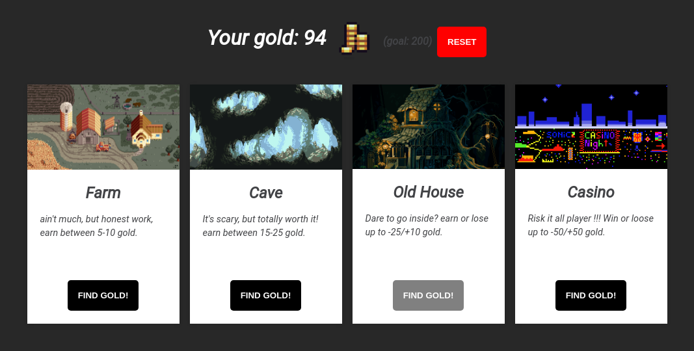

# NINJA GOLD



## Getting Started

Your goal is to collect 200 gold coins. Click on the find the gold buttons, and your score will update. Some places will give you gold coins, some will take it from you. The game will stop if your gold is <= 0, or if your gold is >200.

## Reset
in the game there's two types of reset: 
* hard reset (red button) to reset score and activity log;
* gold reset, will reset gold to zero, when the player gold is bellow <= 0, but the activity log stays untouched, so player can see what's going on.

## Design
I've used some free pixel art from www. Made it mobile responsive, supports: Phone 6/7/8/X iPad, iPad pro, but it was design for desktops, so make sure you check it out !


### Installing
must have pyton 3+, django 2.2.4+
```
#start
python3 manage.py runserver
#open http://127.0.0.1:8000/
```

## Deployment

made with Heroku

## Built With
* Python
* Django

## Author

IURII LYTVYN

## License

Feel free to use it. This project is licensed under the MIT License - see the [LICENSE.md](LICENSE.md) file for details

