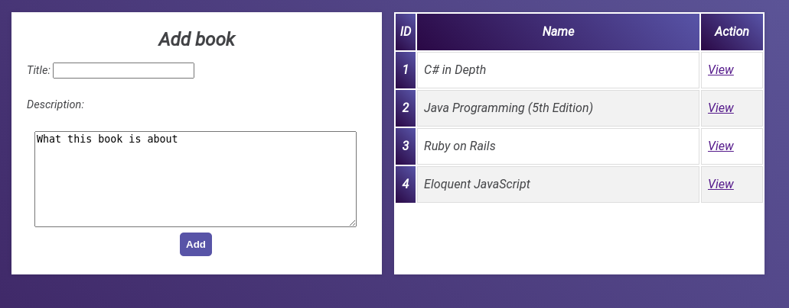

# LIBRARIUM


## Getting Started
This project demonstrates django routes. You can add your books and authors, vice versa


## Reset
there's instructions in models.py how to re-created db. Or you can use db-backup.sqlite3


### Installing
must have pyton 3+, django 2.2.4+
```
#start
python3 manage.py runserver
#open http://127.0.0.1:8000/
```

## Built With
* Python
* Django

## Author

IURII LYTVYN

## License

Feel free to use it. This project is licensed under the MIT License - see the [LICENSE.md](LICENSE.md) file for details

